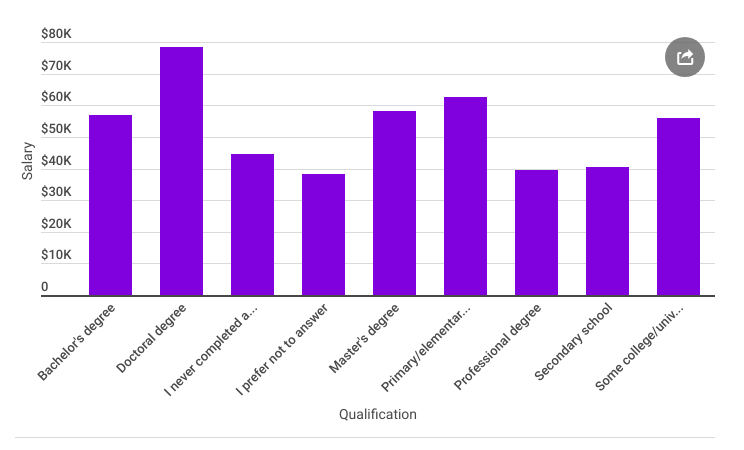
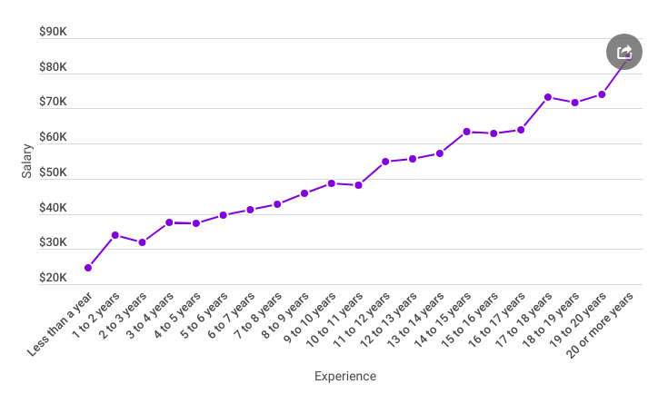
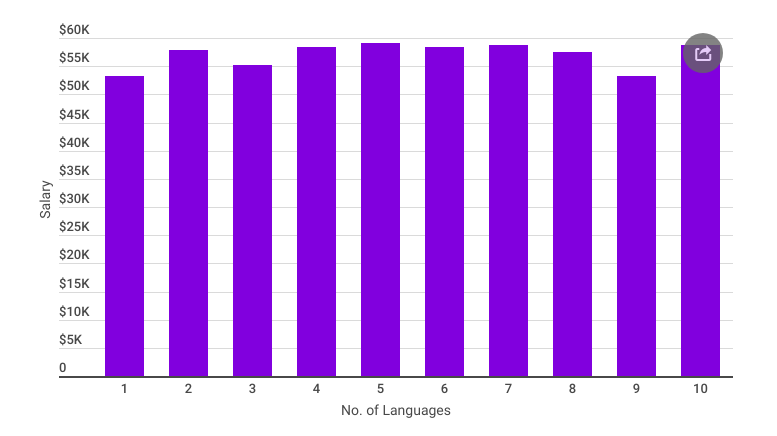

# Stack OverFlow Developers Survey, 2017

## Objectives
- How education may influence the salary?
- Gender Ratio of developers across the globe
- The rate of increase in salary with the years of experience
- More Languages = More Money?

## Summary
### 1. How education may influence the salary?

The developers who own a Doctoral Degree get the highest salary of $78,527, followed by Primary/Elementary School graduates at $62,677 and Master's Degree holder at normal pay of $58,250.

### 2. Gender Ratio of developers across the globe

In this survey, only 2,595 females were recorded out of 34,140 responses which states that there are only 13 female developers over 100 male developers

### 3. The rate of increase in salary with the years of experience

With no surprise, the pattern is linear over the number of years of experience. Those very new to the tech industry, with less than a year of experience, can expect to get a normal pay of $24,673 (a year-over-year increment of 12.16 percent). Following a year or two, that normal pay hops to $33,953 (a whopping 37.6 percent expansion, year-over-year).

### 4. More Languages = More Money?

It doesn't make much difference at all. A developer specialized in one programming language get a normal pay of $53,202 whereas the one who is skilled in 9 different languages get a normal compensation of $53,301 (0.18% more).

### View a detailed analysis report on Medium

## Requirements
`pandas`, `matplotlib`, `jupyter-notebook` (if running locally)

## Files in the repo
- `application.ipynb` - Analysis
- `survey_results_public.csv` - Developers Survey Result Data
- `survey_results_schema.csv` `reviews.csv` - Developers Survey Result Schema

## License

**Copyright (c) 2019 Rohit Swami**

This project is licensed under the MIT License - see the LICENSE file for details

## Acknowledgements
### Data Source
- https://insights.stackoverflow.com/survey/

