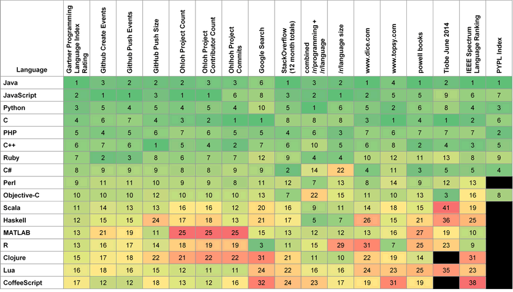
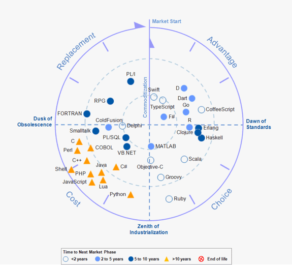
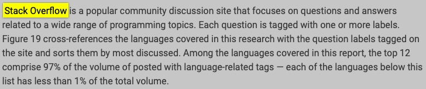
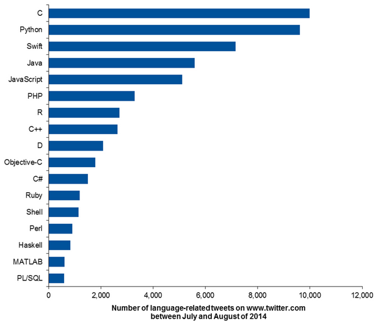

# 01F How I understand Developers

[TOC]

# What is this post about?
## / start from an udacity project requirment

Hi everyone, I am a Udacity `Data Scientist Nanodegre` student, my name is Francis and I am come from China.

In this task, I am going to write a data science blog that can talk about some finding on data and illustrate how a data science can do.

I take the recommended data `stack overflow survey` and I want to give a meaningful introduction or explor for myself on how data science work in daily life. 

## / data science working framework
My data science analysis framework is from `Udacity Data Sciencest Nanodegree`, here is a brief introduction, you can find it out at www.udacity.com or google if you want to learn more.

Data Science CRISP-DM (Cross Industry Process for Data Mining) Frame Work: 
1. Business Understanding
2. Data Understanding
3. Prepare Data
4. Data Modeling
5. Evaluate the Results
6. Deploy

## / my experience with stack overflow

As a data newbee, I found myself rely on stack overflow several times per day. If I put my question in English carefully, there is a great chance (>50%) that I will get some hint or coding from it. And mostly with detailed explanation.

## / content list
According to this Project Requement, and my plan, I am glad to take a try on dedicated blog writing. But for my tied schedule, ESL, and access Medium from China. I decide first to complete my project and update more post after my graduation. 

And this post is the my report version of my writings, if you need more detailed information, you can check out the blog earilyer as below:
- a new git for project1(all code and copy of markdown files)
- README(this file) for introduction 
- Stackover flow survey data (case1)
    - 2/6 Data Understanding
    - 3/6 Prepare Data
    - 6/6 Deploy Data
- datafile(after cleaning)
- github repo: All my data, code, and blog original files (markdown) are in my [/github repo/](https://github.com/mengfanchun2017/delitice/tree/master/%5Bdata_nutshell%5D) under [data_nutshell] folder. 

# How I found about the data?
According 2019's survey, I got match with 6 domain question with 85 columns. It is interesting that columns get less every year (2017-154, 2018-129)

## / data files
There are 9 years data total, with this 3 files with largest size and more detailed information:
- developer_survey_2019, 18.7MB
- developer_survey_2018, 20MB
- developer_survey_2017, 9.6MB

## / data selecting
There are serveral (>80) features in the 2019 data, after a day's compare I found that there only 17 columns are the same compare 2019 to 2018, and only 3 columns compare 2019 to 2017. So I will finish my work first on 2019's data.

So I take many time read the survey and check the data feature by featrue , and get featrues under blow for my analysis. I also post my feature check log at the bottom if you want to more information.  Features I select is 39, and I restructure it into 4 subdomain.

Also I am going to pass any feature that omit more than 20% (ConvertedComp, WorkChallenge, WorkWeekHrs, DatabaseDesireNextYear is important,keep) which are WorkRemote, WorkPlan, SOHowMuchTime, SONewContent

Finial 35 Features and the survey's brief questions are as follows(catn mean the data are category, divided into n values,mul means the answer is a muilty selection):
- Basic Information (9)
    1. MainBranch - [cat6] why are you learning coding?
    2. OpenSourcer - [cat4] how often do you contribute to open source?
    3. OpenSource - [cat3] how do you feel about the quality of open source software (OSS)
    4. Employment - [cat7] which of the following best describe your current employment status?
    5. Age
    6. Student - [cat4] are you a student, and which type of student?
    7. EdLevel - [cat9] highest level of formal education.
    8. UndergradMajor - [cat12] main of most important field of study?
    9. EduOther - [cat10_mul] which of the following types of non-degree education have you used or participated in?
- Your Education, Work, and Career (10)
    1. OrgSize - [cat10] how many people are employed at your company
    2. DevType - [catn] which role do you play at work?
    3. YearsCode - [cat_int] how manyyear have you been coding?
    4. CareerSat - [cat5] overall, how satistied are you with your career thus far?
    5. JobSeek - [cat3] which of the following best describes your current job-seeking status?
    6. JobFactors - [cat10_mul] with same job income, of the following factors, which are most important to you?
    7. ConvertedComp - [cat_int], salary converted to annual USD, need to alter to 10 or less buckets.
    8. WorkWeekHrs - [cat_int], need to alter to 10 or less buckets.
    9. WorkChallenge - [cat9_mul], what are your greatest challenges to productivity as a developer? select up to 3
    10. ImpSyn - [cat5], how do you rate your own level of competence?
- Technology and Tech Culture (7)
    1. LanguageWorkedWith - [catn_mul], which language do you use (maybe use isin for a filter solve)
    2. LanguageDesireNextYear - [catn_mul], which language do you want to learn next year?
    3. DatabaseWorkedWith - [catn_mul]
    4. DatabaseDesireNextYear - [catn_mul]
    5. DevEnviron - [cat_mul], which develop envirment do you use primary.
    6. OpSys - [cat4] what is the primary operating system in which you work?
    7. BetterLife - [cat2] do you think people born today will have a better life than their parents?
- Stack Overflow Usage + Community (9)
    1. SOVisitFreq - [cat6]
    2. SOVisitTo - [cat6_mul] recommend
    3. SOFindAnswer - [cat5]same with SOVisitFreq
    4. SOTimeSaved - [cat5] as well as the last time you solved a problem using SO, compare with other resource, which was faster?
    5. SOPartFreq - [cat6] how frequently would you participate in Q&A?
    6. SOJobs - [cat3] have you ever used or visited SO Jobs?
    7. EntTeams - [cat3] have you ever used SO Enterprise or Teams?
    8. SOComm - [cat6] do you consider yourself a member of the SOCommunity?
    9. WelcomeChange -[cat6] compared to last year, how welcome do you feel on SO?

# Example of Programming Languages analysis from Gartner

I love the 'Developer' from the `Stack Overflow`(see the blog head photos). And developing languages are am topic that get lots of concern for a long time. I find the latest Gartner report:[IT Market Clock for Programming Languages, 2014](https://www.gartner.com/document/2861721?ref=solrAll&refval=226777770&qid=98a6c382aefd7af8bdf697d9f990)

The Gartner gets a pretty wide data source form the web and combined the popularity of each language, to a table:

 _*Gartner 2014 Programming Language Index and External Data Rankings*_ 

And Gartner also provided a life circle of languages, which require more analytical skills.

 _*IT Market Clock for Programming Languages, 2014*_ 

All these chart are base on each data source, for example from the Stack Overflow. The brief introduction and Language count bar chart are as below:

 _*Number of Language-Related Tweets*_ 

And I also found some nice report from Stack Overflow official and other data scientist post. There post are very professional and have insight ideas. I will keep going to practice my skills to reach this standarded.

# My findings

## / conclutions
Before conclution, there are EDA process, for testing the what I am thinking of the data. To keep this post short and not so boring, I will show the my finding here, all of my data and files can be found at github.

## / Finding1 - Does work more time influence income?

- from chart above we can find:
    - people make most income from 35 - 50 hours per week
    - more work time do not get well paid
    - as for the less work hour time

## / Finding2 - Are there many elder soft engineers?

- from chart above we can find:
    - people work as soft engineer when they graduated
    - mode around 28 years old
    - not more soft engineer over 40 years old

## / Finding3 - How do you think of online education?

- from chart above we can find:
    - most of the candidate want to learn new language without formal course (maybe the time is so tight)
    - take a heckathon and a part-time in person are the smallest (maybe people not like tight goal for their spare time learning, or for a new language, these two are not the good perpose)

# Finish
For this project, I review many data analys skill and get some new try. Some are good, and some are failure. I am afrid I do not have time to complete all I thought at the begining.

But this is still a good start, maybe after my graduation from Udacity Data Scienst Nanodegree, I will write and publish more offten.