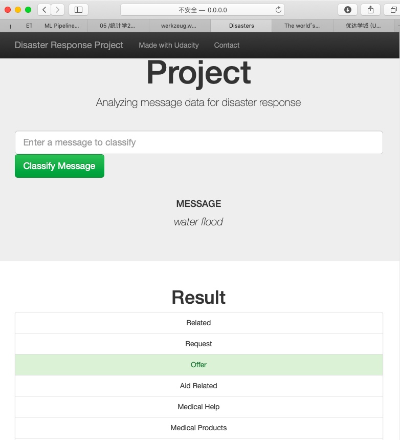

# `Project` Disaster Response Pipelines
[TOC]

# notification
- my mac air need several hours for model training, and I finially got a output 900M.
- first I run my code on workspace, and got a warning: Trying to unpickle estimator GridSearchCV from version 0.20.2 when using version 0.19.1. This might lead to breaking code or invalid results. Use at your own risk. And can not proceed.
- than I run it on my mac air, it runs good, but lack for the show of source chart. for this function is builded in template, I don't put very much attention to solve it.

# ziped file explaination
- I got all the files required:
    - app/run.py (file not any change)
    - data/process_data.py (done, and can quickly processed to generate `YourDatabaseName.db`
    - data/YourDatabaseName.db (generated myself)
    - models/your_model_name.pkl.tar.gz (generated twice from local to pkl, and for git sync limit, I compressd it. **please uncompressed before run run.py**)
- for explain my model code(for it is so slow to run), I also provided my jupyger notebook file and  a html output under data/ for more information

# run_log

## / terminal cmd

```
(py36) FrancisdeMacBook-Air:app francis$ python run.py
Traceback (most recent call last):
  File "run.py", line 33, in <module>
    model = joblib.load("../models/your_model_name.pkl")
  File "/Users/francis/miniconda3/envs/py36/lib/python3.6/site-packages/sklearn/externals/joblib/numpy_pickle.py", line 590, in load
    with open(filename, 'rb') as f:
FileNotFoundError: [Errno 2] No such file or directory: '../models/your_model_name.pkl'
(py36) FrancisdeMacBook-Air:app francis$ ls
run.py		templates
(py36) FrancisdeMacBook-Air:app francis$ pwd
/Users/francis/git/udacity-private/_dsnd/p2_pipeline/p_submit/app
(py36) FrancisdeMacBook-Air:app francis$ python run.py
 * Serving Flask app "run" (lazy loading)
 * Environment: production
   WARNING: This is a development server. Do not use it in a production deployment.
   Use a production WSGI server instead.
 * Debug mode: on
 * Running on http://0.0.0.0:3001/ (Press CTRL+C to quit)
 * Restarting with stat
 * Debugger is active!
 * Debugger PIN: 186-709-812
127.0.0.1 - - [30/Aug/2019 15:18:13] "GET / HTTP/1.1" 200 -
127.0.0.1 - - [30/Aug/2019 15:18:19] "GET /favicon.ico HTTP/1.1" 404 -
127.0.0.1 - - [30/Aug/2019 15:18:28] "GET /go?query=fire+fire+fire HTTP/1.1" 200 -
127.0.0.1 - - [30/Aug/2019 15:18:31] "GET /favicon.ico HTTP/1.1" 404 -
127.0.0.1 - - [30/Aug/2019 15:19:09] "GET /go?query=water+flood HTTP/1.1" 200 -
127.0.0.1 - - [30/Aug/2019 15:19:10] "GET /favicon.ico HTTP/1.1" 404 -
```

## / webpage show
