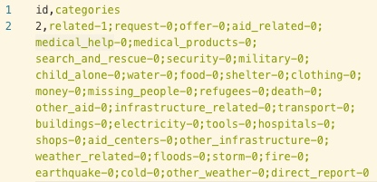
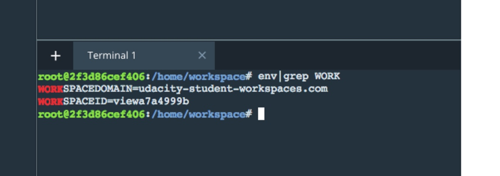

# [P] /Data Engineering/ Project: Disaster Response Pipeline
[TOC]

## / 1.Project Introduction
As this git is derived from an udacity DSND project, I wish to make it more for people who might take a look on how a brief data project looks like.

I'll analyze disaster data from [Figure Eight](https://www.figure-eight.com/) to build a model for an API that classifies disaster messages.


## / 2.Project Files Explained

### // Starter Code
Follow is all the file you need to run this application, with doc structured and explaination:

```
- app
| - template
| |- master.html  # main page of web app
| |- go.html  # classification result page of web app
|- run.py  # Flask file that runs app

- data
|- disaster_categories.csv  # data to process 
|- disaster_messages.csv  # data to process
|- process_data.py # The part of data pipeline is the Extract, Transform, and Load process. Here, it will read the dataset, clean the data, and then store it in a SQLite database.
|- InsertDatabaseName.db   # database to save clean data to. 

- models
|- train_classifier.py
|- classifier.pkl  # saved model, need first uncompress the tar.gz file before run run.py

- README.md
```

### // `data` Explaination
- disaster_categories.csv Contains the data to process about all message categories, is like a given tag on messages, so we can use it as input of our surpervised learning:

- disaster_messages.csv Contains data to process of the messages, already extracted and stored the core information on `message` columns, and put original as the `original` columns. And the `genre` column is the message source:

### // `model` Explaination

You will split the data into a training set and a test set. Then, you will create a machine learning pipeline that uses NLTK, as well as scikit-learn's Pipeline and GridSearchCV to output a final model that uses the `message` column to predict classifications for 36 categories (multi-output classification). Finally, you will export your model to a pickle file. After completing the notebook, you'll need to include your final machine learning code in `train_classifier.py`.

Attention, all you need is to extract .tar.gz when you download the git, and then run the run.py. The `train_classifier.py` is used only you have new data, or you updated your model.

### // notebooks Explanation

As the Project schedule, I firstly finish all my ETL pipeline and ML pipeline on 2 jupyter notebooks. For the sake if you need the detail exploration record, I upload them to the accoring directory too.

## / 3.How to run the code

When working in the Project Workspace IDE, here is how to see your Flask app.Open a new terminal window. You should already be in the workspace folder, but if not, then use terminal commands to navigate inside the folder with the run.py file.

Type in the command line:
    
    python run.py 

Your web app should now be running if there were no errors.Now, open another Terminal Window.Type:
    
    env|grep WORK

You'll see output that looks something like this:


In a new web browser window, type in the following:

    https://SPACEID-3001.SPACEDOMAIN
    
In this example, that would be: "https://viewa7a4999b-3001.udacity-student-workspaces.com/" (Don't follow this link now, this is just an example.)

**Attention:** If you run it at local, you need to take a look at flask output log, the ip address may be like http://0.0.0.0/
