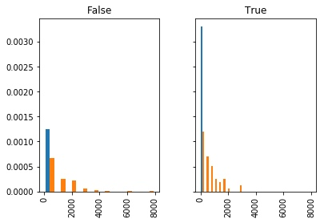
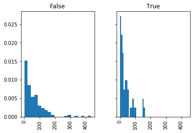
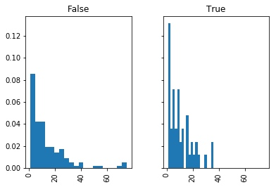

# 01F Spark Rubic Report
[TOC]

# Project Definition

## / Project Overview
> Student provides a high-level overview of the project. Background information such as the problem domain, the project origin, and related data sets or input data is provided.

Hi everyone, I am a Udacity `Data Scientist Nanodegre` student, my name is Francis and I am come from China.

In this task, I am going to write a data science blog that can talk about some finding on data and illustrate how a data science can do.

I take the sparkify project to practice my experience with spark. It is heard that sparkify is founded after the founder was reject by google. And when google want to take sparkify, he gave a very high price to show his attitude: NO WAY!


## / Problem Statement
> The problem which needs to be solved is clearly defined. A strategy for solving the problem, including discussion of the expected solution, has been made.

For a online music company, it is really important to identify which user is turn off his scribe. For Sparkify, Apple music is a strong competetive. So if we can predect who is going to leave, we can give the one something to stay, such as coupon or special discount.

And maybe we can also study the 'cancel' user why they are leave. And put forward for our Product.

From my experience, online music company is much more rely on technology. For there are huge songs in the world, and the recommendation and service is more useful to a user, if it really goes into ones heart. (As contrary to online vedio company).

## / Metrics
> Metrics used to measure performance of a model or result are clearly defined. Metrics are justified based on the characteristics of the problem.

As for the Metrics, we use `BinaryClassificationEvaluat` from pyspark for a full methord. This methord finds the best model by maximizing the model evaluation metric that is the area under the specified curve. [/Official Links/](https://jaceklaskowski.gitbooks.io/mastering-apache-spark/spark-mllib/spark-mllib-BinaryClassificationEvaluator.html)

# Analysis
## / Data Exploration
> Features and calculated statistics relevant to the problem have been reported and discussed related to the dataset, and a thorough description of the input space or input data has been made. Abnormalities or characteristics about the data or input that need to be addressed have been identified.

After load the data, We can exploration just like in the pandas, below is a few exploration (for full process please check the notebook)

### // check page value
```python
# check - 'page' value
df_clean.select("page").dropDuplicates().show()
```
```python
- output -
+--------------------+
|                page|
+--------------------+
|              Cancel|
|    Submit Downgrade|
|         Thumbs Down|
|                Home|
|           Downgrade|
|         Roll Advert|
|              Logout|
|       Save Settings|
|Cancellation Conf...|
|               About|
|            Settings|
|     Add to Playlist|
|          Add Friend|
|            NextSong|
|           Thumbs Up|
|                Help|
|             Upgrade|
|               Error|
|      Submit Upgrade|
+--------------------+
```

### // filter cancel user
```python
# filter cancel user

## use Cancellation Confirmation define user lose
cancel_user_df = df.filter(df.page=="Cancellation Confirmation").select("userId").dropDuplicates()
cancel_user_list = [user["userId"] for user in cancel_user_df.collect()]
display(cancel_user_list[:10])

## create column for canceled or not user on category type
df_clean = df_valid.withColumn("cancel", df_valid.userId.isin(cancel_user_list))
df_clean
```

```
- output -
['125', '51', '54', '100014', '101', '29', '100021', '87', '73', '3']
```

### // group by gender
```python
# group by gender
df_clean.dropDuplicates(['userId']).groupby(['gender','cancel']).count().show()
```
```
- output - 
+------+------+-----+
|gender|cancel|count|
+------+------+-----+
|     M|  true|   32|
|     F| false|   84|
|     F|  true|   20|
|     M| false|   89|
+------+------+-----+
```

## / Data Visualization
> Features and calculated statistics relevant to the problem have been reported and discussed related to the dataset, and a thorough description of the input space or input data has been made. Abnormalities or characteristics about the data or input that need to be addressed have been identified.

### // gender divided played songs stats
```python
# gender divided played songs stats
df_clean_songs = df_clean.where(df_valid.song!='null').groupby(['cancel','userId']) \
    .agg(count(df_valid.song).alias('SongsPlayed')).orderBy('cancel').toPandas()
df_clean_songs.hist(['SongsPlayed'], by='cancel', sharex=True, sharey=True,density=1)
plt.plot();
```


### // gender divided thumps-up stats
```python
# gender divided thumps-up/down stats (up)
df_clean_thumbsup = df_clean.where(df_valid.page=='Thumbs Up') \
    .groupby(['cancel','userId']).agg(count(col('page')).alias('ThumbsUps')).orderBy('cancel').toPandas()
df_clean_thumbsup.hist('ThumbsUps', by='cancel', bins=20, sharex=True, sharey=True, density=1);

print('ThumbsUps for people who stay',
      df_clean_thumbsup[df_clean_thumbsup['cancel']==False]['ThumbsUps'].mean())
print('ThumbsUps for people who leave',
      df_clean_thumbsup[df_clean_thumbsup['cancel']==True]['ThumbsUps'].mean())
      
- output -
ThumbsUps for people who stay 62.89411764705882
ThumbsUps for people who leave 37.18
```


### // gender divided thumps-down stats
```python
# git rid of warnings
import warnings; warnings.simplefilter('ignore')

# gender divided thumps-up/down stats (down)
df_clean_thumbsdown = df_clean.where(df_valid.page=='Thumbs Down') \
    .groupby(['cancel','userId']).agg(count(col('page')).alias('ThumbsDowns')).orderBy('cancel').toPandas()
df_clean_thumbsdown.hist('ThumbsDowns', by='cancel', bins=20, sharex=True, sharey=True, density=1);

print('ThumbsDowns for people who stay',
      df_clean_thumbsdown[df_clean_thumbsup['cancel']==False]['ThumbsDowns'].mean())
print('ThumbsDowns for people who leave',
      df_clean_thumbsdown[df_clean_thumbsup['cancel']==True]['ThumbsDowns'].mean())

- output -
ThumbsDowns for people who stay 12.735294117647058
ThumbsDowns for people who leave 11.545454545454545
```


# Methodology
## / Data Preprocessing
> All preprocessing steps have been clearly documented. Abnormalities or characteristics about the data or input that needed to be addressed have been corrected. If no data preprocessing is necessary, it has been clearly justified.

### // Feature Engineering
I need change str type to 0/1, so ml can be trained.
```python
df_gender = df_clean.dropDuplicates(['userId']).sort('userId').select(['userId','gender'])
df_gender = df_gender.replace(['F','M'], ['1', '0'], 'gender')
df_gender.withColumn('gender', df_gender.gender.cast("int"))

df_gender.show()
```

```
- output - 
+------+------+
|userId|gender|
+------+------+
|    10|     0|
|   100|     0|
|100001|     1|
|100002|     1|
|100003|     1|
|100004|     1|
|100005|     0|
|100006|     1|
|100007|     1|
|100008|     1|
|100009|     0|
|100010|     1|
|100011|     0|
|100012|     0|
|100013|     1|
|100014|     0|
|100015|     1|
|100016|     0|
|100017|     0|
|100018|     0|
+------+------+
```

```python
# feature2 played songs
df_songs = df_clean.where(df_clean.song!='null').groupby('userId') \
    .agg(count(df_clean.song).alias('SongsPlayed')).orderBy('userId') \
    .select(['userId','SongsPlayed'])
df_songs.show()
```
```
+------+-----------+
|userId|SongsPlayed|
+------+-----------+
|    10|        673|
|   100|       2682|
|100001|        133|
|100002|        195|
|100003|         51|
|100004|        942|
|100005|        154|
|100006|         26|
|100007|        423|
|100008|        772|
|100009|        518|
|100010|        275|
|100011|         11|
|100012|        476|
|100013|       1131|
|100014|        257|
|100015|        800|
|100016|        530|
|100017|         52|
|100018|       1002|
+------+-----------+
only showing top 20 rows
```

```python
# feature3 thumps up/down
df_thumbsup = df_clean.where(df_clean.page=='Thumbs Up') \
    .groupby(['userId']).agg(count(col('page')).alias('ThumbsUps')).orderBy('userId').select(['userId','ThumbsUps'])
df_thumbsdown = df_clean.where(df_valid.page=='Thumbs Down') \
    .groupby(['userId']).agg(count(col('page')).alias('ThumbsDowns')).orderBy('userId').select(['userId','ThumbsDowns'])
df_thumbsup.show(),df_thumbsdown.show();
```
```
+------+---------+
|userId|ThumbsUps|
+------+---------+
|    10|       37|
|   100|      148|
|100001|        8|
|100002|        5|
|100003|        3|
|100004|       35|
|100005|        7|
|100006|        2|
|100007|       19|
|100008|       37|
|100009|       23|
|100010|       17|
|100012|       18|
|100013|       39|
|100014|       17|
|100015|       35|
|100016|       25|
|100017|        2|
|100018|       46|
|100019|        1|
+------+---------+
only showing top 20 rows

+------+-----------+
|userId|ThumbsDowns|
+------+-----------+
|    10|          4|
|   100|         27|
|100001|          2|
|100004|         11|
|100005|          3|
|100006|          2|
|100007|          6|
|100008|          6|
|100009|          8|
|100010|          5|
|100011|          1|
|100012|          9|
|100013|         15|
|100014|          3|
|100015|          8|
|100016|          5|
|100017|          1|
|100018|          9|
|100019|          1|
|100021|          5|
+------+-----------+
only showing top 20 rows
```

```python
# feature4 singers number
df_singers = df_clean.dropDuplicates(['userId','artist']).groupby('userId') \
    .agg(count(df_clean.artist).alias('SingersListened')).orderBy('userId') \
    .select(['userId','SingersListened'])
df_singers.show()
```
```
+------+---------------+
|userId|SingersListened|
+------+---------------+
|    10|            565|
|   100|           1705|
|100001|            125|
|100002|            184|
|100003|             50|
|100004|            733|
|100005|            149|
|100006|             26|
|100007|            357|
|100008|            623|
|100009|            442|
|100010|            252|
|100011|             11|
|100012|            397|
|100013|            826|
|100014|            233|
|100015|            627|
|100016|            431|
|100017|             51|
|100018|            780|
+------+---------------+
only showing top 20 rows
```

```python
# join features
df_final = df_clean.dropDuplicates(['userId']).sort('userId').select(['userId','cancel'])
for feature in [df_gender, df_songs,df_thumbsup,df_thumbsdown,df_singers]:
    df_final = df_final.join(feature,'userId')
    
df_final.show()
```
```
+------+------+------+-----------+---------+-----------+---------------+
|userId|cancel|gender|SongsPlayed|ThumbsUps|ThumbsDowns|SingersListened|
+------+------+------+-----------+---------+-----------+---------------+
|300018|   0.0|   0.0|     1640.0|    132.0|       24.0|         1170.0|
|300019|   0.0|   0.0|      798.0|     83.0|        8.0|          650.0|
|200008|   0.0|   1.0|     1669.0|     68.0|       52.0|         1159.0|
|200009|   0.0|   0.0|      963.0|     41.0|       32.0|          746.0|
|300009|   0.0|   1.0|     1427.0|    132.0|       15.0|         1025.0|
|300010|   0.0|   0.0|      263.0|     21.0|        1.0|          244.0|
|    30|   0.0|   0.0|     1417.0|     62.0|       17.0|         1018.0|
|300001|   1.0|   1.0|     1749.0|    148.0|       17.0|         1201.0|
|200018|   1.0|   0.0|      367.0|     13.0|       11.0|          317.0|
|200019|   0.0|   0.0|      495.0|     28.0|       17.0|          427.0|
|100008|   0.0|   1.0|      772.0|     37.0|        6.0|          623.0|
|100009|   1.0|   0.0|      518.0|     23.0|        8.0|          442.0|
|    91|   0.0|   0.0|     2580.0|    124.0|       24.0|         1618.0|
|    92|   0.0|   1.0|     5945.0|    292.0|       72.0|         2904.0|
|   127|   0.0|   1.0|     1779.0|     93.0|       15.0|         1221.0|
|   128|   0.0|   0.0|     1728.0|     87.0|       18.0|         1163.0|
|    41|   0.0|   1.0|     1894.0|     76.0|       10.0|         1319.0|
|    42|   0.0|   1.0|     3573.0|    166.0|       25.0|         2073.0|
|100017|   1.0|   0.0|       52.0|      2.0|        1.0|           51.0|
|100018|   0.0|   0.0|     1002.0|     46.0|        9.0|          780.0|
+------+------+------+-----------+---------+-----------+---------------+
only showing top 20 rows
```

### // file persistence
For the spark lazy evaluation methrod. To avoid run on notebook slow, persistence before use ml predict is a good choice when explore.

```python
# file persistence
## saving to csv
file_final = 'mini_sparkify_event_data_final.csv'
#df_final.write.save(file_final, format="csv", header=True)

## read final data (much quick for show)
df_final = spark.read.csv(file_final, header=True)
```

### // Train|Test Split
```python
# train test split
train, test = df_final.randomSplit([0.8, 0.2], seed=42)
```

## / Implementation
> The process for which metrics, algorithms, and techniques were implemented with the given datasets or input data has been thoroughly documented. Complications that occurred during the coding process are discussed.

### // Setting for all algorithms
```python
# ml pipeline
## setting
assembler = VectorAssembler(inputCols=df_final.columns[2:],
                            outputCol='featuresassemble')
scaler = StandardScaler(inputCol="featuresassemble", outputCol="features",
                        withStd=True)
indexer = StringIndexer(inputCol="cancel", outputCol="label")
stringIndexer = StringIndexer(inputCol="label", outputCol="indexed")
```

### // Logical Regression
```python
# lr
## algorithm
lr =  LogisticRegression(maxIter=10, regParam=0.0, elasticNetParam=0)

## pipeline
pipeline_lr = Pipeline(stages=[assembler, scaler, indexer, lr])
paramGrid_lr = ParamGridBuilder() \
    .addGrid(lr.elasticNetParam,[0.0, 0.5, 1.0]) \
    .addGrid(lr.regParam,[0.0, 0.05, 0.1]) \
    .build()
crossval_lr = CrossValidator(estimator=pipeline_lr,
                          estimatorParamMaps=paramGrid_lr,
                          evaluator=BinaryClassificationEvaluator(),
                          numFolds=3)

## fit
cvModel_lr = crossval_lr.fit(train)
```

### // Decision Tree
```python
# dt
## algorithm
dt = DecisionTreeClassifier()

## pipeline
pipeline_dt = Pipeline(stages=[assembler, scaler, indexer, dt])
paramGrid_dt = ParamGridBuilder() \
    .addGrid(dt.impurity,['entropy', 'gini']) \
    .addGrid(dt.maxDepth,[3, 4, 5, 6, 7]) \
    .build()
crossval_dt = CrossValidator(estimator=pipeline_dt,
                          estimatorParamMaps=paramGrid_dt,
                          evaluator=BinaryClassificationEvaluator(),
                          numFolds=3)

## fit
cvModel_dt = crossval_dt.fit(train)
```

### // GBT
```python
# gbt
## algorithm
gbt = GBTClassifier()

## pipeline
pipeline_gbt = Pipeline(stages=[assembler, scaler, indexer, gbt])
paramGrid_gbt = ParamGridBuilder() \
    .addGrid(gbt.maxIter,[3, 10, 20]) \
    .addGrid(gbt.maxDepth,[2, 4, 6, 8]) \
    .build()
crossval_gbt = CrossValidator(estimator=pipeline_gbt,
                          estimatorParamMaps=paramGrid_gbt,
                          evaluator=BinaryClassificationEvaluator(),
                          numFolds=3)

## fit
cvModel_gbt = crossval_gbt.fit(train)
```

## / Refinement
> The process of improving upon the algorithms and techniques used is clearly documented. Both the initial and final solutions are reported, along with intermediate solutions, if necessary.

### // Grid Search
To Find the best algorithms, I use Grid Search to test many params in the section above. Finally to print out and compare:

```python
# result
display('--- lr ---', cvModel_lr.avgMetrics)
display('--- dt ---', cvModel_dt.avgMetrics)
display('--- gbt ---', cvModel_gbt.avgMetrics)
```

```
'--- lr ---'
[0.6487595092246256,
 0.6532277154370177,
 0.6513901311866428,
 0.6487595092246254,
 0.6490950425543448,
 0.6709799244682965,
 0.6487595092246256,
 0.6780087322238485,
 0.6793958141341863,
 0.6487595092246256,
 0.6793958141341863,
 0.5221445221445221]
'--- dt ---'
[0.5736208236208237,
 0.5928758741258741,
 0.5910114675376303,
 0.4889766967528595,
 0.5067900042463995,
 0.6288049321479554,
 0.6573623082344012,
 0.6394610799407312,
 0.5711472393885184,
 0.5602783763394229]
'--- gbt ---'
[0.6278262273901809,
 0.5603435405034243,
 0.5406964321208507,
 0.603113141703258,
 0.6554603503731411,
 0.6082345706618962,
 0.5465851493467773,
 0.5692669652698722,
 0.6428867159971812,
 0.6134314974431253,
 0.5525996209862489,
 0.5853310610578052]
```
### // Large Data
As taking three methord (lr, dt, gbt) to compute the prediction, it turned out that lr get the best score (nearly 0.68). So is it the best? My answer is: No!

So I am trying run the project with full data (12GB) on AWS EMR, I think the result might be improved later. (I will updated after my AWS runs.)

# Results
## / Model Evaluation and Validation
> If a model is used, the following should hold: The final model’s qualities — such as parameters — are evaluated in detail. Some type of analysis is used to validate the robustness of the model’s solution.

> Alternatively a student may choose to answer questions with data visualizations or other means that don't involve machine learning if a different approach best helps them address their question(s) of interest.

As refered above, I recaped the Evaluation and Validation below:
- As for the Metrics, we use `BinaryClassificationEvaluat` from pyspark for a full methord. 
- I choose three algorithm to test
    - Logistic Regression
    - Decision Tree
    - GBT
- And use GridSearchCV to find out each best params
    - LR
        - elasticNetParam,[0.0, 0.5, 1.0]
        - regParam,[0.0, 0.05, 0.1]
    - DT
        - impurity,['entropy', 'gini']
        - maxDepth,[3, 4, 5, 6, 7]
    - GBT
        - maxIter,[3, 10, 20]
        - maxDepth,[2, 4, 6, 8]

For the reason I run project on my lattop, these are not very complicated matix to derive the best answer. I will try more when the env is ready.

## / Justification
> The final results are discussed in detail.
Exploration as to why some techniques worked better than others, or how improvements were made are documented.

For this project, I thought about the result of claasification prediction. We have good reason to excute the promotion action even we can get better results later. 

For Cancel User is far less than normal user, So if we score 68%, give all that we predict will happens below:
- 1st, we got 68% user who are going to cancel, and through promotion action, there should be many of them to stay.
- 2nd, for the rest of 32%, although we made a mistake on them, but a bit promotion is not so costly. Besides these one received promotion might be glad to share it to others to bring more satisfaction among users.