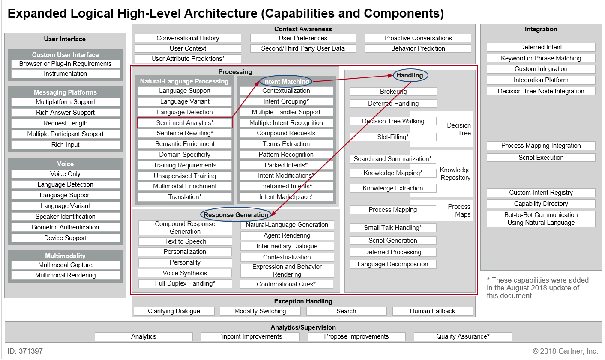
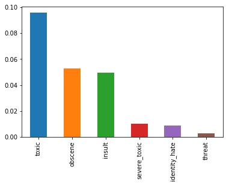
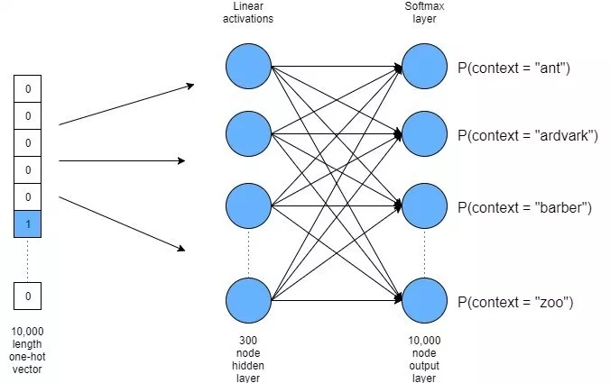
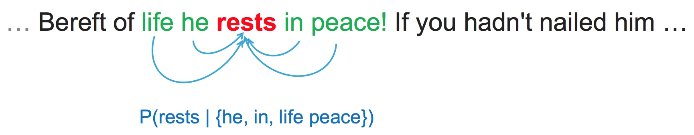
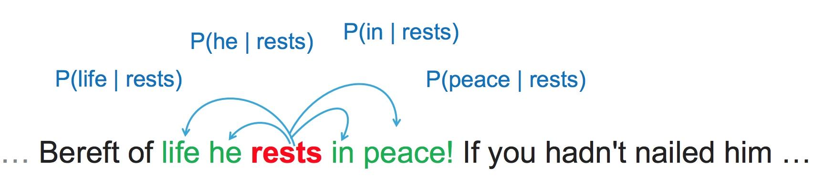
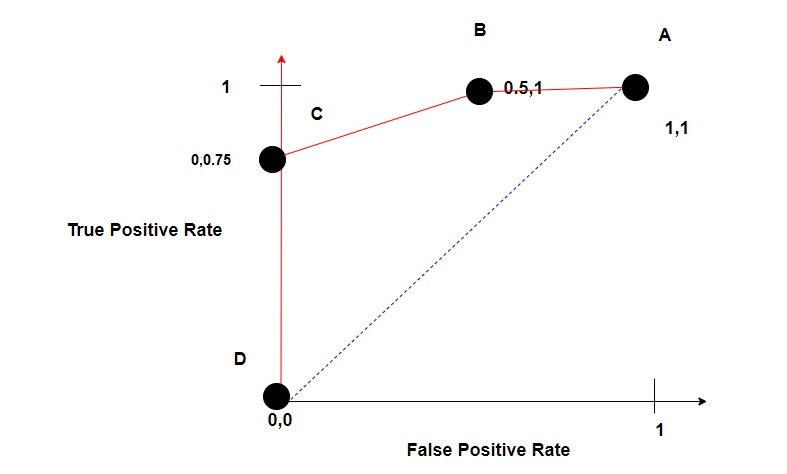
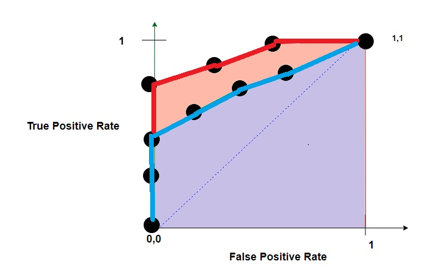
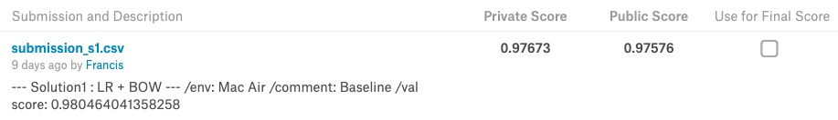
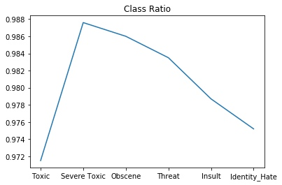
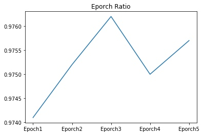

# mlnd projet capestone - Proprosal_lm_v3

*机器学习纳米学位毕业项目（恶毒评论）*

> 20190425 v3 

评审老师好：
因为资源和对算法的理解问题，又是比较久才提交初稿项目文件，本版本基本完成了项目要求内容。但由于资源问题还没解决，内容并不完善，请老师对还需修改的地方指点一下，我再有针对性的补充（项目日期比较紧张）。

另外还想请教下对于这个项目（需使用预训练数据）线上资源 Google Colab 和 Kaggle Kernel 那个比较合适（AWS的比较麻烦还收费，先pass了）。

文件说明：
- `数据处理和探索文件` capestone_report_Investigate.ipynb
- `方法1代码` capestone_report_solution1.ipynb
- `方法2代码` capestone_report_solution2_3.ipynb
- `数据可视化代码` capestone_report_visual.ipynb

---
*（以下为 Proposal 评审内容，已经通过）*
> 项目问题，请老师指点（v2已经反馈解决）：

**问题1：**Kaggle 在给出 Test 数据时为什么要披露条目是否是恶毒评论或是正常评论。（问题在项目中有详细说明）
答复：这个标签是在比赛结束后，Kaggle给出参考的，在训练时不需使用。另外，在数据中加入了 fake data，防止选手对于测试集进行标注。

**问题2：**目前看需要使用AWS GPU主机进行项目的分析，因为时间非常紧迫（还有3周，对AWS不熟悉），想问下：**如果使用迁移学习的方法，这个项目可能在没有独立显卡的笔记本跑完么？**
答复：根据学习成本，资源选择顺序如下，具体使用情况将在报告最后更新。

**问题3：**请问老师多分类的情况用什么可视化展示比较好。（这种情况用什么可视化展示比较好？（问题在项目中有详细说明）
答复：使用条形图就可以表达了。

> 20190418 v2 修改稿（已经通过，评审

评审老师好：
根据反馈，修改的地方如下：
1. 学生清晰的描述了需要解决的问题。问题被明确的定义出来并且至少有一个可能的解决办法。此外，还要求这个问题可以被量化，被衡量以及可重现的。）
    1. 根据反馈增加了 _具体指出该多分类问题的特点的相关内容。_
    2. 该任务是一个标签不平衡的文本多分类问题，并且每条数据可能对应不止一个标签。
    3. 已经修改。
2. 学生提出了一个用于量化基准模型和解决方案的评估标准。这个评估标准对于问题本身、数据集以及解决方案来说都是合适的。
    1. 评审老师反馈使用，mean-auc 评测。找到了相关的说明[^mean-auc]。指的是： `the score is the average of the individual AUCs of each predicted column.` AUC 进行评估的说明更新在了项目相应部分。
    2. 已经修改。
3. 学生总结了一个针对问题解决方案的实施理论流程。探讨了计划采取的策略，对数据需要进行哪些分析，考虑哪些算法。这些流程和探讨符合该问题的特点。我们鼓励把数据简单可视化，加入一些对解释有帮助的伪代码及图表。
    1. 传统词袋模型参考课程链接中的第一个模型：[^wordbag]
    2. 已经修改。
4. 文本跟新说明
    1. 本版本根据反馈更新，并为了可读性对于模版中的要求进行删减。

[^wordbag]: [词袋模型 + LR 解决方案(Kaggle)](https://www.kaggle.com/tunguz/logistic-regression-with-words-and-char-n-grams)
[^mean-auc]: [Jigsaw's Text Classification Challenge - A Kaggle Competition(NYC)](https://nycdatascience.com/blog/student-works/toxic-comment-classification-challenge-a-kaggle-competition/)


> 20190318 v1 初稿

评审老师好：

本次提交为恶毒评论的 Proposal，因为 Proposal 模版是英文的，而项目模版的前面 I问题的定义、II分析、III方法 部分与 Proposal 模版比较一致，这里就将 Proposal 的内容直接写在了项目模版的 I、II、III 部分，请老师审阅。

- - -

[TOC]
 
# I. 问题的定义

## 项目概述

本部分描述了项目的总体的概念。包括问题涉及哪个领域、选择项目的出发点、有哪些数据。

- **项目的背景：**是对网络中的评论进行情感分析。掌握大众的情感趋势有很多价值，比如检测对于公司品牌的评价、对于知名人物的评价或者政府的渔情监控等。
- **项目的出发点：**对自然语言处理有兴趣，生活中也接触到了不少产品。比如 `Apple Siri` 、 `小米 小爱同学` 等等。而且目前 `Text Analytics` 也已经达到了技术成熟区，如这张 Gartner 的炒作周期图所示[^hype]:
*<center> $_{数据科学炒作周期图（来自Gartner）}$</center>*

- **项目的数据：**本项目中的数据是 `kaggle` 中一次恶毒语言分类测试，主要目标是对所提供的数据中的评论进行情感的分类：
    - 属于监督学习下的深度学习解决范畴
    - 提供了带标签的训练集、不带标签的测试集
    - 需要提交测试集的情感分析归类分析
        - 分为6类负面情感
        - 归类为多选
- **项目领域：**涉及自然语言处理领域的工作，调研了一下目前NLP的情况，总结如下：
    - NLP的wiki定义是：Natural language processing (NLP) is a subfield of computer science, information engineering, and artificial intelligence concerned with the interactions between computers and human (natural) languages, in particular how to program computers to process and analyze large amounts of natural language data. [^NLP]
    - NLU的定义是（是NLP的其中一部分）：Natural-language understanding (NLU) or natural-language interpretation (NLI)[1] is a subtopic of natural-language processing in artificial intelligence that deals with machine reading comprehension. Natural-language understanding is considered an AI-hard problem. [^NLU]
    - 本项目中要实现的情感分析实际上是 `对话平台` 中的一部分[^con_archi]：
*<center> $ _{对话平台高阶架构（来自Gartner）}$ </center>* 

    - 其中的情感分析 `Sentiment Analytics`，Gartner公司的定义是：Categorizes and identifies opinions expressed in the phrases the user is writing and attempts to derive the user’s attitude toward topics, products or services. 从图中可以看出，情感分析只是 Processing 中 Natural-Language Processing(NLP) 分析的一小环。而所有NLP输出后会进入到 Intent Maching 阶段，之后就会推给算法进行处理。再之后会根据场景需求作出反馈。完成 `输入处理-算法实现-输出生成` 对话平台的核心功能。
    - 实际工业化产品，可以参照 `Amazon Lex` 深度学习平台的这篇介绍，在工业化的过程中，很多产品功能已经打包为模块，并且全部基于云计算实现，使得任何一个小的企业都可以尽快使用相关的会话平台，示例结构图如下[^amazon_lex]：
*<center> $_{在 Amazon Connect 联络中心使用 Amazon Lex 聊天机器人进行自然对话（来自AWS）}$</center>*


[^hype]: [Hype Cycle for Data Science and Machine Learning, 2018（Gartner）](https://www.gartner.com/document/3883664?ref=solrAll&refval=218831438&qid=f09c9a3aa881a9d98e9e862)
[^NLP]: [Natural Language Processing（Wiki）](https://en.wikipedia.org/wiki/Natural_language_processing)
[^con_archi]: [Architecture of Conversational Platforms（Gartner）](https://www.gartner.com/document/3889098?ref=solrAll&refval=218829016&qid=c2ec3dd07deced1f309)
[^amazon_lex]: [Amazon Lex（AWS）](https://amazonaws-china.com/cn/lex/)
[^NLU]: [Natural Language Understanding（Wiki）](https://en.wikipedia.org/wiki/Natural-language_understanding)

## 问题陈述

本部分为项目解决问题将要使用的策略（任务的大纲）的讲解。明确想要期望的结果是怎样的。在本部分要明确定义解决的问题、和如何解决并且期望的结果是什么。

### // 要解决的问题

根据给出的 train 带标签数据，通过使用深度学习（监督学习）得出分类算法，能够对未来评论语句的负面情感进行感知。

### // 解决问题的方法

- I Prepare
    - 检查数据质量，如果需要做相应处理
    - 将 train 数据划分为 train 和 validation 两个集合
- II Algorithm
    - 根据项目的特点选择算法
    - 选择合适的迁移学习数据
    - 搭建算法学习环境
    - 得出模型
    - 得出算法结论
- III Optimize
    - 回顾模型和项目要求对算法进行优化调整
    - 搜索相关文献
    - 调整算法模型
    - 得出最终结论
- IV Finish
    - 完成论文的组织修改
    - 准备所有资源列表
    - 提交项目

## 评价指标
这部分包括用于评价自己的模型和结果的**指标**和**计算方法**。包括定义了所使用的指标和计算方法以及这些指标和计算方法的合理性。

- 数据来源于 Kaggle 竞赛，最终评价为上传 Kaggle 得出的评分。
- Kaggle 的评分方式为：
    - 根据 test 数据计算出 result
    - result 为 test 数据的多分类准确性测量
    - Kaggle 的评分标准并未公开

# II. 分析

## 数据的探索
在这一部分，你需要探索你将要使用的数据。数据可以是若干个数据集，或者输入数据/文件，甚至可以是一个设定环境。你需要详尽地描述数据的类型。如果可以的话，你需要展示数据的一些统计量和基本信息（例如输入的特征（features)，输入里与定义相关的特性，或者环境的描述）。你还要说明数据中的任何需要被关注的异常或有趣的性质（例如需要做变换的特征，离群值等等）。

## / 回答

- _如果你使用了数据集，你要详尽地讨论了你所使用数据集的某些特征，并且为阅读者呈现一个直观的样本_

**数据列说明：**
1. train数据包括 id + comment + 6categroy label，一共是8列数据。其中6个分类标签为多选分类（用1标识），同一条数据可以同时属于这6个分类（这样的例子有39个）。也可以那个都不属于（所有分类标识都为0）
1. test数据包括 id + comment 是用来测试的数据
1. test_label数据包括 id + 6category bilabel，提示了那条数据是恶毒数据（所有6分类都为1，反之全为0）

- _如果你使用了数据集，你要计算并描述了它们的统计量，并对其中与你问题相关的地方进行讨论_

**数据文件列表：**

| file | shape | note |
| --- | --- | --- |
| train.csv | 159571, 8 | 包含id、评论和分类 |
| test.csv | 153164, 2 | 包含id和评论 |
| test_labels.csv | 153164, 7 | 包含id和2分类 |

- _如果你**没有**使用数据集，你需要对你所使用的输入空间（input space)或输入数据进行讨论？_

1. 使用了数据集，Pass此部分。

- _数据集或输入中存在的异常，缺陷或其他特性是否得到了处理？(例如分类变数，缺失数据，离群值等）_

1. 所有数据都很干净，无重复，无缺失
2. 由于是语言分析，其他统计学参数相关度不大
3. 比较1:恶毒评论比率
	1. train数据0.1017，test数据0.3779
4. 思考：对于test数据有两种使用方法
	1. 第一种全部使用，生成结果以后可以对非恶毒评论是否正确做判断。但这个结果可能会诱导分析人员进行参数调优，违反测试数据只能使用一次的原则。
	2. 第二种情况，过滤出test中的恶毒评论进行分析，不考虑正常评论。这样可以不犯第一种的错误。
	3. 提交要求：根据 `Kaggle` 竞赛的说明和 `sample submition` 文件样式，需要提交包括非恶毒评论的分类[^kaggle_official]。
	4. 事后验证：但是可以根据 kaggle 提交的成绩和 test 中正常评论筛选出来的比率做比较，检查以下假设：是否恶毒评论分类越准确的算法，在识别正常评论方面也会很准确。
5. **请教问题：**请问老师这里应该怎么处理比较好，如果上面假设有关系的话，应该根据这种反馈调整算法得到更好分数么？为什么 Kaggle 在竞赛的 test 数据中会披露那些语句不是恶毒评论，这样做的目的是什么？

[^kaggle_official]: [Toxic Comment Classification Challenge(Kaggle)](https://www.kaggle.com/c/jigsaw-toxic-comment-classification-challenge/data)

## 探索性可视化
在这一部分，你需要对数据的特征或特性进行概括性或提取性的可视化。这个可视化的过程应该要适应你所使用的数据。就你为何使用这个形式的可视化，以及这个可视化过程为什么是有意义的，进行一定的讨论。

## / 回答

- _你是否对数据中与问题有关的特性进行了可视化？_
    - 恶毒评论单分类比例汇总，可以看到6个分类的排列情况：

    - 多选分类出现的统计：因为这里是多选，想展示下多选的组合情况，因为从1个分类到6个分类的情况全部都有，没有想到用那个图。
    - **请问老师：**这种情况用什么可视化展示比较好？我想出的折中方法是做热力图，展示两两出现的feature的集合比率。但又觉得这样展示比较奇怪。
- _你对可视化结果进行详尽的分析和讨论了吗？_
    - 根据上面的分类情况，可以看到6个分类从 toxic、obscene、insult、severe toxic、identity hate、threat 逐渐比例下降。而情感的极端情况也是逐渐增加，和假设的情况比较温和。
- _绘图的坐标轴，标题，基准面是不是清晰定义了？_
    - 将在后续版本中完成。
- **---v1 updata---**
    - 根据评审老师提醒，这里还应该对数据的特点进行描述：
        - 这是一个不平衡分类数据。
        - 这是一个多分类数据。

### 算法和技术
在这一部分，你需要讨论你解决问题时用到的算法和技术。你需要根据问题的特性和所属领域来论述使用这些方法的合理性。你需要考虑：
- _你所使用的算法，包括用到的变量/参数都清晰地说明了吗？_
- _你是否已经详尽地描述并讨论了使用这些技术的合理性？_
- _你是否清晰地描述了这些算法和技术具体会如何处理这些数据？_

### // 使用的算法和技术

根据项目要求，分为3个相并列算法部分完成：
1. 连续词袋模型。
2. wrod2vex + GloVe（6B）模型。
3. word2vex + GloVe（840B）模型（需要资源配置完成后再研究）。

**连续词袋模型：**
- 环境准备
    - 从文件生成数据 `train_features`,`train_target`, `test`, `test_labels`。
    - 最后的提交为 `submission.csv` 对应为根据算法生成的 `test` 多分类概率。
    - `test_labels`标识了是否为普通或者属于至少一个分类的test属性，在本方法中不采用。
- 向量化
    - 使用 `TfidfVectorzer` 将 comment 数据进行向量化。
        - comment 向量化（word）
            - 对 comment 进行以词为单位的向量化，使用参数 `analyzer='word' ngram_range=(1,1)`
            - 得出 1w dimension
            - 存为 `train_comment_features`, `test_comment_features`
        - ngram 向量化（character）
            - 对 comment 进行以字母（2-4个）为单位的向量化，使用参数 `analyzer='char' ngram_range=(2,4)`
            - 得出 5w dimension
            - 存为 `train_character_features`, `test_character_features` 
    - 将上述两个向量化堆叠
            - 存为`train_features`, `test_features`
            - 都具有 6w demension
- 评分
    - 建立评分规则
        - 设定空 `score_list`
        - 根据提交要求设定 `submission` 格式
        - 定义 classifier 使用 `LogisticRegression`
    - 循环评分
        - 对6个分类（列）使用循环完成评分
        - 使用 `train_features`, `train_target` 对模型进行适配
        - 使用模型计算 score
        - 将 score 续写到 score_list 并打印 score
    - 平均评分
        - 对6个分类的评分做平均，得出最终评分（训练数据集的）
- 结论
    - 使用训练好的算法得出 submission.csv
    - 提交 kaggle 计算得分

**wrod2vex 模型（keras + Glove（6B tokens, 400K vocab）:**
- 环境准备
    - 从文件生成数据 `train_features`,`train_target`, `test`, `test_labels`。
    - 最后的提交为 `submission.csv` 对应为根据算法生成的 `test` 多分类概率。
    - `test_labels`标识了是否为普通或者属于至少一个分类的test属性，在本方法中不采用。
- Embedding Layer 准备
    - 上传 Embedding Layer 文件。
    - 准备 Embedding Layer 层。
        - 设定 input_dim 参数
        - 设定 output_dim 参数
        - 设定 input_length 参数
    - 将上述两个向量化堆叠
            - 存为`train_features`, `test_features`
            - 都具有 6w demension
- 建立模型（Sequence）
    - 建立 指定使用Sequence模型 
    - 建立 embedded_sequences
    - 建立 activation（n次）
    - 建立 Flatten
    - 建立 Dense
- 评分
    - 使用 mode.evalute进行评分（training）
- 结论
    - 使用训练好的算法得出 submission.csv
    - 提交 kaggle 计算得分

**wrod2vex 模型（keras + Glove（840B tokens, 2.2M vocab）:**
- 基本同上个模型，通过对比 6B 和 840B 的 Pre-Trained 数据，发现数据对于模型训练的影响。

完成项目资源说明：
1. 因为时间比较紧凑，开始想使用优达深度学习的项目空间（前一个项目还剩比较多GPU时间），结果项目介绍中的3个词处理平台都需要进行命令行操作需要使用 AWS 空间带 GPU 的虚拟机解决[^awsdl]。
2. 后来在探索中发现 Google Colab 提供在线 Jupyter Notebook 可以免费集成 GPU/TPU，学习成本更好，改为尝试 Colab[^colab]。
3. 库方面开始像使用课程中讲解的 keras，感觉比较简洁。后续探索发现很多介绍使用的是 Gemsim，原因是 Gesim 底层使用的 C ，效率很快，但需要 Cpython 支持[^gensim]。
4. 具体方法将在项目代码部分做详细说明。

[^colab]: [Learn how to build deep learning systems in Google Colaboratory](https://adventuresinmachinelearning.com/introduction-to-google-colaboratory/)
[^awsdl]: [How to create a TensorFlow deep learning powerhouse on Amazon AWS](https://adventuresinmachinelearning.com/category/amazon-aws/)
[^gensim]: [Gensim Wrod2Vec Tutorial(Web)](https://adventuresinmachinelearning.com/gensim-word2vec-tutorial/)
[^glove]: [GloVe: Global Vectors for Word Representation（Stanford）](https://nlp.stanford.edu/projects/glove/)
[^vector]: [English word vectors（FastText）](https://fasttext.cc/docs/en/english-vectors.html)
[^udadl]: [Udacity Deep Learning Workspace (Udacity)](https://classroom.udacity.com/nanodegrees/nd009-cn-advanced/parts/bfc08027-d9e2-4483-839c-e6ec1e2ada4c/modules/10b781e7-357b-4e54-8180-4a55a1daf6dc/lessons/2df3b94c-4f09-476a-8397-e8841b147f84/concepts/e4af01b5-73c7-4af7-ba56-e0098bd0b026)
[^glovevec]: [How is GloVe different from word2vec](https://www.quora.com/How-is-GloVe-different-from-word2vec)
[^subword]: [FastText Word Embedding](https://cloud.tencent.com/developer/news/297583)

### // 论述技术的合理性

本节主要论述使用 wrod2vex 的工作原理：

**word2vex之前的算法：**
在word2vex之前的几种方法简介：
- Word Embedding ： 是将自然语言中的组语言模型（language modeling）映射到特征学习技术（feature learning techniques）的方法。输入是自然语言，输出是把输入中的单词（或者短语）映射成向量（转化为数学问题）。
- Word Embedding 方法1：BOG（词袋，或者CBOG），方法是将输入中出现的所有词作独热编码，对于这些采用独热编码的向量，在句子的颗粒度作加和。这种方法的缺点有两个：
    - 没有考虑单词顺序（相邻关系）的影响。
    - 向量可能非常长。
- Word Embedding 方法2：n-gram ，这种方法假设，每一个词出现的概率仅依赖于该词前面的n-1个词。
- Word Embedding 方法3：Cocurrence Matrix（共现矩阵），这种方法通过限定窗口大小来看核心词和窗口（类似于n-gram中的n）中其他词的向量关系。
    - 比如窗口为2的例子如下：

    - 最后得出矩阵：

- Word Embedding 方法4：NLM（神经语言模型，NNLM）。使用词向量作输入，NLM 要解决的问题是解析出相似含义词都有哪些，并且让相近含义的词在目标向量空间中距离更近。

**word2vex原理：**
在前面的`NLM`基础上扩展的的`word2vex`的核心思想是将一个词的意义用它周围的词进行表示（In Word2Vec, the meaning of a word is roughly translatable to context – and it basically works [^word2vectu].） ，这种表示是将他周围的词做为目标词的预测，转换为向量。这种向量对应的是词语的意义，这样多对一的关系，可以简化计算，也更准确。所以方法叫做 word2vec，比如这个奖1万个词映射到300维意义的示例图，出处同本段脚注：



- 1万个output是过程数据，用于计算过程中的反向传播。
- 最终的输出是 10000 * 300 的矩阵。
- 当有一个词的时候，我们就可以查这 10000 个词的表，得出这个词是在 300 个向量中，最符合（概率最大）的，就预测词的意思了。
- 但是1万个input计算量比较复杂，所以还使用了 negative sampling 的方法进行了简化计算。比如这个 `vocabulary_size = 7`, `embedding_size=3` 的例子[^word2veckeras]：


[^word2vectu]: [Python gensim Word2Vec tutorial with TensorFlow and Keras](https://adventuresinmachinelearning.com/gensim-word2vec-tutorial/)
[^word2veckeras]: [A Word2Vec Keras tutorial](https://adventuresinmachinelearning.com/word2vec-keras-tutorial/)

word2vex具体计算采用了两种可选的数学计算方法：CBOW 和 Skip-gram的方式，再加上 Hierarchical Softmax 进行降维降低计算成本。两种方式的主要区别是（参考前面窗口大小的概念）：
- CBOW 是根据周围的词预测核心词（Condition on context, and generate centre word）：

- Skip-gram 是根据核心词预测周围的词（Generates each word in context given centre word）：


**迁移学习数据选择：**
- 选择 gensim 直接实现 word2vex，原因是：  
- 也可以选择 fastText [^fasttest] 。在 word2vex 的基础上增加了词频的相关数据，由 facebook 提出。比如这个数据：FastText `Common Crawl 2M with Subword 版本（5.83GB）`[^vector]。
    - WordVector 的调用方式见脚注链接说明。
    - WordVector 支持157种语言，包括中文，同见脚注链接。
    - Subword 是对词频出现较少词的修正：
        - 因为 word2vec 使用的最小单位是一个word，通过中心词预测上下文的词汇。
        - 那么，一个句子长短不同，我们怎么衡量词之间的向量关系呢？我们可以使用 n-gram 限定一次考察几个词的关系。        
        - 比如 n-gram = 3，前2个词是 featrue，后面的一个词就是 label。
        - 具体计算时候，还会设定一些常用的词不使用 n-gram[^subword]。
- 也可以选择GloVe `Common Crawl 840B 版本（2.03GB）`[^glove]。GloVe 的主要特点是结合了统计值和向量（距离），而 WordVector 只考虑向量 [^glovevec]。

**参考资料：**
1. fastText官网[^fasttest]
2. Word Embedding 与 Word2Vec[^embedding1]
3. 自然语言处理 Word Embedding[^embedding2]
4. 图解 Word2Vec[^embedding2]

[^fasttest]: [fastText官网（fastText）](https://fasttext.cc/)
[^embedding1]: [Word Embedding 与 Word2Vec（csdn）](https://blog.csdn.net/baimafujinji/article/details/77836142)
[^embedding2]: [自然语言处理 Word Embedding（csdn）](https://blog.csdn.net/L_R_H000/article/details/81320286)
[^embedding3]: [图解 Word2Vec（wechat）](https://mp.weixin.qq.com/s/CgbmO6u-Kk-2fCF4ZwtcZQ)

### // 使用算法处理数据的过程

### 基准模型
在这一部分，你需要提供一个可以用于衡量解决方案性能的基准结果/阈值。这个基准模型要能够和你的解决方案的性能进行比较。你也应该讨论你为什么使用这个基准模型。一些需要考虑的问题：
- _你是否提供了作为基准的结果或数值，它们能够衡量模型的性能吗？_
- _该基准是如何得到的（是靠数据还是假设）？_

### // 基准值和衡量标准

衡量标准为 Kaggle 的竞赛标准，当提交数据之后，Kaggle 将会在后台与 Testing 的标签（并未发布）作比较，得出评分。
**---updated v2---：**
使用的是 AUC 进行衡量标准，AUC 可以衡量分类问题的效率，具体原理下面介绍。

### // 基准值有效的原理

由于是基于 Label 的评分，为最终依据，并且后续不会有更新。属于监督学习的范围，评分有效性高且为唯一评分标准。
**---updated v2---：**
对 AUC 的解释：
- 混淆矩阵
    - 混淆矩阵是通过衡量 False Positive 和 Ture Positive 的比率来评判模型的效率的。
    - 这两个指标的定义见混淆矩阵图：


- 受试者工作曲线（ROC Curve）
    - 根据不同的数据分割，我们可以得到很多 （[0,1],[0,1]) 的二维坐标，这些坐标连接起来就构成了 ROC Curve： 


- 曲线面积 （AUC）
    - 那么仅仅比较不同算法之间的曲线关系，有时候不是很明显[^auc]：

    - 可以使用曲线下的面积进行衡量（ AUC ： Area Under Curve）[^roc_and_auc]，具体计算公式见[^auc_standfor]：


[^roc_and_auc]: [Understanding the ROC and the AUC Curve](https://towardsdatascience.com/understanding-the-roc-and-auc-curves-a05b68550b69)
[^auc]: [Konw about AUC](http://fastml.com/what-you-wanted-to-know-about-auc/)
[^auc_standfor]: [What does AUC stand for and what is it(StackExchange)](https://stats.stackexchange.com/questions/132777/what-does-auc-stand-for-and-what-is-it)

## III. 方法

### 数据预处理
在这一部分， 你需要清晰记录你所有必要的数据预处理步骤。在前一个部分所描述的数据的异常或特性在这一部分需要被更正和处理。需要考虑的问题有：
- _如果你选择的算法需要进行特征选取或特征变换，你对此进行记录和描述了吗？_
- _**数据的探索**这一部分中提及的异常和特性是否被更正了，对此进行记录和描述了吗？_
- _如果你认为不需要进行预处理，你解释个中原因了吗？_

### // 数据预处理（方法1）

- 使用 sklearn 中的 TfdfVectorizer 进行向量化。
- 作为基准变量，没有额外进行字符的处理。
- 按照 word 和 char 的方式分别增加 1w 和 5 w 的features：

```python
# build vectorizer

## set comment vectorizer
comment_vectorizer = TfidfVectorizer(
    sublinear_tf=True,
    strip_accents='unicode',
    analyzer='word',
    token_pattern=r'\w{1,}',
    stop_words='english',
    ngram_range=(1, 1),
    ## 表示只拆解1个单词，如果是(1:2)表示拆解1-2个单词
    ## https://stackoverflow.com/questions/24005762/understanding-the-ngram-range-argument-in-a-countvectorizer-in-sklearn
    max_features=10000)

## fit comment vectorizer
comment_vectorizer.fit(train_comment)

## get train and test comment featrues
train_comment_features = comment_vectorizer.transform(train_comment)
test_comment_features = comment_vectorizer.transform(test_comment)


## set ngram vectorizer
character_vectorizer = TfidfVectorizer(
    sublinear_tf=True,
    strip_accents='unicode',
    analyzer='char',
    stop_words='english',
    ngram_range=(2, 4),
    ## 标识对应 2到4个字母的组合
    max_features=50000)

## fit character vectorizer
character_vectorizer.fit(train_comment)

## get train and test ngram featrues
train_character_features = character_vectorizer.transform(train_comment)
test_character_features = character_vectorizer.transform(test_comment)

## check features with both word and character (train)
train_features = hstack([train_comment_features, train_character_features])
train_features.shape
## 可以看出对于每个评论，featrues 输出为 1w word + 5w ngram = 6w

## check features with both word and character (test)
test_features = hstack([test_comment_features, test_character_features])
test_features.shape
```
输出为：
> (159571, 60000)
> (153164, 60000)

### // 数据预处理（方法2）

- 因为使用 Keras 完成模型，所以向量化使用 Keras Tokenizer 方法完成
- 对于数据的长度做检查，限制 max_feature 的长度
- 从 comment 的 分布观察大概100词的长度超过了80%，padded 的长度设置为100，降低计算量

```python
max_feature = 10000
max_lenth = 100

## prepare tokenizer
t = Tokenizer(filters='!"#$%&()*+,-./:;<=>?@[\\]^_`{|}~\t\n', lower=True, split=' ', num_words=max_feature )
## https://keras.io/preprocessing/text/
## 可以考虑直接去掉奇怪字符、lower
t.fit_on_texts(train_comment)
## 这里是对输入句子进行拆词
## 在这个数据里，如果输入了1000句（测试文件中的train_short)，结果是10007个
## 如果输出的话在1000之后会有个...
## 全部输入的话是21万多
## 可以使用 num_words 做限制

vocab_size = len(t.word_index) + 1
## 根据上面设置 vocab_size

## integer encode the documents
encoded_train = t.texts_to_sequences(train_comment)
encoded_test = t.texts_to_sequences(test_comment)

## pad documents to a max length of 100 words
max_length = 300

## max_length 就是每个commet要处理的单词数
padded_train = pad_sequences(encoded_train, maxlen=max_length, padding='post')
padded_test = pad_sequences(encoded_test, maxlen=max_length, padding='post')
```

### 执行过程
在这一部分， 你需要描述你所建立的模型在给定数据上执行过程。模型的执行过程，以及过程中遇到的困难的描述应该清晰明了地记录和描述。需要考虑的问题：
- _你所用到的算法和技术执行的方式是否清晰记录了？_
- _在运用上面所提及的技术及指标的执行过程中是否遇到了困难，是否需要作出改动来得到想要的结果？_
- _是否有需要记录解释的代码片段(例如复杂的函数）？_

### // 执行过程（方法1）

**创建提交文件：**
```python
## 建立评分列表
score_list = []

## 根据submission sample定义 submission格式
submission = pd.DataFrame.from_dict({'id': test['id']})
```

**定义分类器：**
```python
## 定义 classifier
classifier = LogisticRegression(C=0.1, solver='sag')
```

**对每个分类做预测：**
```python
## 循环每一个分类
for name in class_list:
    # 获取当前分类数据
    train_target = train[name]
    
    # fit classifier
    classifier.fit(train_features, train_target)
    
    # 计算 training score
    score = np.mean(cross_val_score(classifier, train_features, train_target, scoring='roc_auc', cv=5))
    ## 新版本的默认 cv 已经从3变为5，手动设定5，保持一致

    # 将 score 写入 score_list
    score_list.append(score)
    # 输出 score
    print('(training) Class {} Score : {}'.format(name, cv_score))
    
    # 使用 classier 输出 test 的结果
    submission[name] = classifier.predict_proba(test_features)[:, 1]

# get finial score
print('(training) Average Class Score: {})'.format(np.mean(score_list)))    
```

> 输出：
```python
(training) Class toxic Score : 0.971520588226553
(training) Class severe_toxic Score : 0.9876289384719945
(training) Class obscene Score : 0.9860771390906266
(training) Class threat Score : 0.9835028550329452
(training) Class insult Score : 0.97875904830758
(training) Class identity_hate Score : 0.9752953024910692
(training) Average Class Score: 0.980464041358258)
```

**生成交付物：**
```python
# output submission
filename = 'submission_s1.csv'
submission.to_csv(filename, index=False)
print('Complete: output file saved as {}'.format(filename))
```

### // 执行过程（方法2）

**创建 embedding 层：**
```python
# 创建 embedding 层（300D）

embed_demention = 300

## 导入pre-training
embeddings_index = dict( )
f = open('glove.6B.300d.txt')
for line in f:
    values = line.split()
    word = values[0]
    coefs = np.asarray(values[1:], dtype='float32')
    embeddings_index[word] = coefs
f.close()
print('Loaded %s word vectors.' % len(embeddings_index))

## 创建嵌入矩阵
embedding_matrix = np.zeros((vocab_size, embed_demention))
## 注意这里要和嵌入矩阵的维度300相同
for word, i in t.word_index.items():
    embedding_vector = embeddings_index.get(word)
    if embedding_vector is not None:
        embedding_matrix[i] = embedding_vector
```
> 输出：
> Loaded 400000 word vectors.

**拆分数据：**
```python
# split train and val
x_train, x_val , y_train, y_val = train_test_split(padded_train, train_label, test_size=0.2, shuffle=True, random_state=42)
```

**建立模型：**
```python
## model
model = Sequential()
## 设置embedding层
e = Embedding(vocab_size, 300, weights=[embedding_matrix], input_length=300, trainable=False)
model.add(e)

model.add(Dropout(0.2))
model.add(BatchNormalization())
model.add(Conv1D(64, 5, padding='same', kernel_regularizer=l2(0.01)))
model.add(MaxPool1D())

model.add(Dropout(0.2))
model.add(BatchNormalization())
model.add(Conv1D(128, 3, padding='same', kernel_regularizer=l2(0.01)))
model.add(MaxPool1D())

model.add(Flatten())
model.add(Dense(6, activation='sigmoid'))
# 6分类 Dense为6

## compile the model
model.compile(optimizer='adam', loss='binary_crossentropy', metrics=['acc'])
## summarize the model
print(model.summary())
```
> 输出：
```python
_________________________________________________________________
Layer (type)                 Output Shape              Param #   
=================================================================
embedding_22 (Embedding)     (None, 300, 300)          63101400  
_________________________________________________________________
dropout_21 (Dropout)         (None, 300, 300)          0         
_________________________________________________________________
batch_normalization_21 (Batc (None, 300, 300)          1200      
_________________________________________________________________
conv1d_17 (Conv1D)           (None, 300, 64)           96064     
_________________________________________________________________
max_pooling1d_13 (MaxPooling (None, 150, 64)           0         
_________________________________________________________________
dropout_22 (Dropout)         (None, 150, 64)           0         
_________________________________________________________________
batch_normalization_22 (Batc (None, 150, 64)           256       
_________________________________________________________________
conv1d_18 (Conv1D)           (None, 150, 128)          24704     
_________________________________________________________________
max_pooling1d_14 (MaxPooling (None, 75, 128)           0         
_________________________________________________________________
flatten_14 (Flatten)         (None, 9600)              0         
_________________________________________________________________
dense_13 (Dense)             (None, 6)                 57606     
=================================================================
Total params: 63,281,230
Trainable params: 179,102
Non-trainable params: 63,102,128
```

**适配数据：**
```python
## fit the model
model.fit(x_train, y_train, batch_size=64, epochs=5, validation_data=(x_val, y_val), verbose=2)
```
> 输出：
```python
Train on 127656 samples, validate on 31915 samples
Epoch 1/5
 - 2396s - loss: 0.1664 - acc: 0.9730 - val_loss: 0.2794 - val_acc: 0.8944
Epoch 2/5
 - 2255s - loss: 0.1004 - acc: 0.9753 - val_loss: 0.0910 - val_acc: 0.9758
Epoch 3/5
 - 2255s - loss: 0.0904 - acc: 0.9758 - val_loss: 0.0864 - val_acc: 0.9755
Epoch 4/5
 - 2256s - loss: 0.0840 - acc: 0.9760 - val_loss: 0.0822 - val_acc: 0.9762
Epoch 5/5
 - 2257s - loss: 0.0824 - acc: 0.9764 - val_loss: 0.0842 - val_acc: 0.9769
```

**保存模型权重：**
```python
model.save_weights('s2_weight.h5')
```

**生成交付物：**
```python
# output submission
y_target = model.predict(padded_test)
submission = pd.read_csv('sample_submission.csv')
submission[["toxic", "severe_toxic", "obscene", "threat", "insult", "identity_hate"]] = y_target
submission.to_csv('submission_s2.csv', index=False)
```

### 完善
在这一部分，你需要描述你对原有的算法和技术完善的过程。例如调整模型的参数以达到更好的结果的过程应该有所记录。你需要记录最初和最终的模型，以及过程中有代表性意义的结果。你需要考虑的问题：
- _初始结果是否清晰记录了？_
- _完善的过程是否清晰记录了，其中使用了什么技术？_
- _完善过程中的结果以及最终结果是否清晰记录了？_

### // 完善（方法1）

- 对于准确度有一点提升（基于开始的测试模型，非竞赛模型）：
    - 不做处理 Accuracy: 95.334365
    - 做处理 Accuracy: 95.417087
- 根据 proposal 评审老师的建议: `scoring = ‘roc_auc'`
- 使用了 cross_validation: `cv=5` 
- 以上两点的代码：`score = np.mean(cross_val_score(classifier, train_features, train_target, scoring='roc_auc', cv=5))`


### // 完善（方法2）

- 使用 Tokenizer 的 filters 参数
    - ```python
Tokenizer(filters='!"#$%&()*+,-./:;<=>?@[\\]^_`{|}~\t\n', lower=True, split=' ', num_words=max_feature )`
```
- 使用 300D 与训练权重
    - 根据方法1的输出，50D 与 300D 差别明显，直接使用 300D
- 增加 Dropout 层
    - 由于训练的 epoch 不是很大（mac air 计算很慢），dropout使用比较小的值 0.2
- 增加 Eporch
    - 当前使用的是 Eporch=5，评分上升比较明显，说明还有很大进步空间
    - 后续复盘时计划使用线上资源增加 Eporch 预计显著提高

## IV. 结果

### 模型的评价与验证
在这一部分，你需要对你得出的最终模型的各种技术质量进行详尽的评价。最终模型是怎么得出来的，为什么它会被选为最佳需要清晰地描述。你也需要对模型和结果可靠性作出验证分析，譬如对输入数据或环境的一些操控是否会对结果产生影响（敏感性分析sensitivity analysis）。一些需要考虑的问题：
- _最终的模型是否合理，跟期待的结果是否一致？最后的各种参数是否合理？_
- _模型是否对于这个问题是否足够稳健可靠？训练数据或输入的一些微小的改变是否会极大影响结果？（鲁棒性）_
- _这个模型得出的结果是否可信？_

### // 模型评价与验证（方案1）
- 评分方法：
    - `AUC`
- 使用验证集的评分：
    - `Toxic : 0.971520588226553`
    - `Severe_Toxic : 0.9876289384719945`
    - `Obscene : 0.9860771390906266`
    - `Threat : 0.9835028550329452`
    - `Insult : 0.97875904830758`
    - `Identity_Hate : 0.9752953024910692`
- 平均得分：
    - `Average : 0.980464041358258`
- Kaggle得分[^kaggles]：
    - `Public : 0.97673`（部分测试数据）
    - `Private : 0.97576`（全部测试数据）



[^kaggles]: [What is the difference between public and private leaderboard in Kaggle?(Web)](https://www.quora.com/What-is-the-difference-between-public-and-private-leaderboard-in-Kaggle)

### // 模型评价与验证（方案2）
- 评分方法：
    - `ACC`
- 损失函数：
    - `Binary Crossentropy`
- 优化方法：
    - `Adam`
- Eporch得分：
    - Train on 127656 samples, validate on 31915 samples
    - Epoch 1/5
        - 2354s - loss: 0.1683 - acc: 0.9727 - val_loss: 0.1039 - val_acc: 0.9741
    - Epoch 2/5
        - 2346s - loss: 0.1027 - acc: 0.9748 - val_loss: 0.0925 - val_acc: 0.9752
    - Epoch 3/5
        - 2452s - loss: 0.0906 - acc: 0.9756 - val_loss: 0.0835 - val_acc: 0.9762
    - Epoch 4/5
        - 2485s - loss: 0.0852 - acc: 0.9760 - val_loss: 0.0855 - val_acc: 0.9750
    - Epoch 5/5
        - 2272s - loss: 0.0826 - acc: 0.9762 - val_loss: 0.0827 - val_acc: 0.9757
- Kaggle得分：
    - 两次执行时都在 save 时候出现问题，暂时没有 Kaggle 得分
    - `Private : 0.97576`

### 合理性分析
在这个部分，你需要利用一些统计分析，把你的最终模型得到的结果与你的前面设定的基准模型进行对比。你也分析你的最终模型和结果是否确确实实解决了你在这个项目里设定的问题。你需要考虑：
- _最终结果对比你的基准模型表现得更好还是有所逊色？_
- _你是否详尽地分析和讨论了最终结果？_
- _最终结果是不是确确实实解决了问题？_

根据项目中方案1和方案2的方法可以看出：
**方案1:**
- 作为基准线的 LR 方案能够得到 0.97673 的成绩非常满意，模型计算速度非常快在 Mac Air 上完全没有压力。
- 再加上这是一个多分类的问题，经常会有一条评论同时属于多个负面评论分类中的情况。这使得 97.7% 的利用率已经具有实际价值。
**方案2:**
- 因为用的是笔记本完成的，特意选择了 GloVe 最小的迁移学习数据包。
- Eporch1 的成绩为 0.9741，说明迁移学习包的效果生效了。
- Eporch5 的成绩为 0.9757，进步了0.0016。继续进行的话将会超过方案1的基准。
- 训练量来讲，虽然最后的生成阶段会停止服务，没有生成提交文件。但模型训练每个 Eporch 大概使用了1小时（笔记本），在商业上还是可以接受的。
- （后续争取配置完成 Colab 环境，补上结果，目前遇到些困难）

### // 

## V. 项目结论

### 结果可视化
在这一部分，你需要用可视化的方式展示项目中需要强调的重要技术特性。至于什么形式，你可以自由把握，但需要表达出一个关于这个项目重要的结论和特点，并对此作出讨论。一些需要考虑的：
- _你是否对一个与问题，数据集，输入数据，或结果相关的，重要的技术特性进行了可视化？_
- _可视化结果是否详尽的分析讨论了？_
- _绘图的坐标轴，标题，基准面是不是清晰定义了？_

**方法1:**
6个分类在验证集上的得分如下，可以看到 Toxic 虽然出现几率最高，但是识别率较低。推断是因为情感越强烈，越容易判断。


**方法2:**
随着Eporch数量的上升，得分上升，并在第4次下降产生波动，若进行更多的Eporch，评分推断会震荡上升。



### 对项目的思考
在这一部分，你需要从头到尾总结一下整个问题的解决方案，讨论其中你认为有趣或困难的地方。从整体来反思一下整个项目，确保自己对整个流程是明确掌握的。需要考虑：
- _你是否详尽总结了项目的整个流程？_
- _项目里有哪些比较有意思的地方？_
- _项目里有哪些比较困难的地方？_
- _最终模型和结果是否符合你对这个问题的期望？它可以在通用的场景下解决这些类型的问题吗？_

总结：
- 项目选择的是之前没接触过的NLP情感分析。
- 整体流程和一般项目不同，分析的开放性和方案可选范围都很大。从而也增加了完成的难度。
- 比较有意思的地方是对于 Eembedding 的学习和理解，以及 Word2Vec 方法的学习，这种方式真的非常巧妙。
- 困难的地方非常多，目前卡在了计算资源的运用上，由于是在集显笔记本上完成的项目，方法1跑的很好，方法2总在最后生成文件时候出现错误。后续完善需哟尝试线上资源。
- 最终模型和结果符合期望：
    - 方法1计算量极少，但效果不错。
    - 方法2可以通过Eporch的迭代提升准确性，这在商业运用中有实际意义。

### 需要作出的改进
在这一部分，你需要讨论你可以怎么样去完善你执行流程中的某一方面。例如考虑一下你的操作的方法是否可以进一步推广，泛化，有没有需要作出变更的地方。你并不需要确实作出这些改进，不过你应能够讨论这些改进可能对结果的影响，并与现有结果进行比较。一些需要考虑的问题：
- _是否可以有算法和技术层面的进一步的完善？_
- _是否有一些你了解到，但是你还没能够实践的算法和技术？_
- _如果将你最终模型作为新的基准，你认为还能有更好的解决方案吗？_

有些问题，后续复盘时要再深入：
- 对于模型类型的掌握需要深入。
- 对于整体工作流程的衔接和熟练程度要加强。
- 对于很多基于RNN的算法没有尝试过。
- 对于线上资源的使用调度上。
- 随着学习新的算法、甚至复合算法，并且配置好了使用的GPU资源，还能有不少提升。

----------

**在提交之前， 问一下自己：** 

- 你所写的项目报告结构对比于这个模板而言足够清晰了没有？
- 每一个部分（尤其**分析**和**方法**）是否清晰，简洁，明了？有没有存在歧义的术语和用语需要进一步说明的？
- 你的目标读者是不是能够明白你的分析，方法和结果？
- 报告里面是否有语法错误或拼写错误？
- 报告里提到的一些外部资料及来源是不是都正确引述或引用了？
- 代码可读性是否良好？必要的注释是否加上了？
- 代码是否可以顺利运行并重现跟报告相似的结果？

> 脚注：